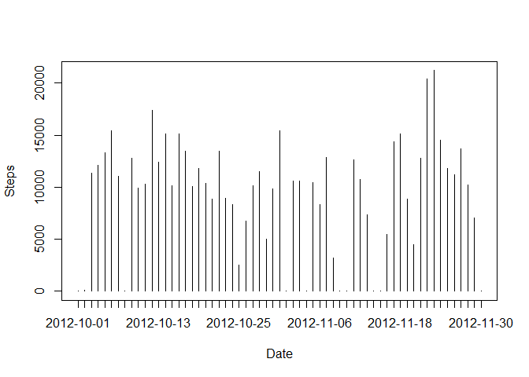
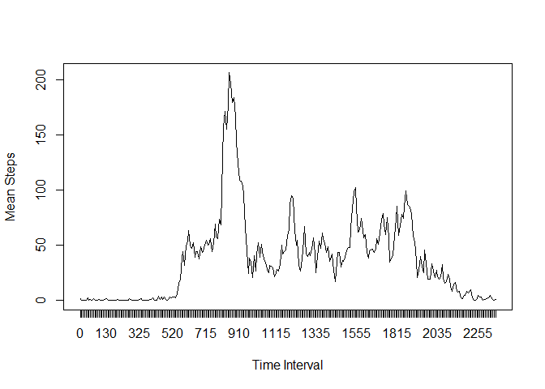
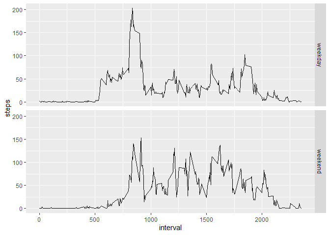

Loading and Pre-processing the data
-----------------------------------

    library(chron)

    ## NOTE: The default cutoff when expanding a 2-digit year
    ## to a 4-digit year will change from 30 to 69 by Aug 2020
    ## (as for Date and POSIXct in base R.)

    library(dplyr)

    ## 
    ## Attaching package: 'dplyr'

    ## The following objects are masked from 'package:stats':
    ## 
    ##     filter, lag

    ## The following objects are masked from 'package:base':
    ## 
    ##     intersect, setdiff, setequal, union

    library(ggplot2)
    library(reshape2)
    activity<-read.csv("activity.csv")

What is mean total number of steps taken each day?
--------------------------------------------------

    tot_steps1<-tapply(activity$steps,as.factor(activity$date),sum,na.rm=TRUE)
    plot(tot_steps1,type = "h", xaxt="n",xlab = "Date",ylab = "Steps")
    axis(1,at=c(1:dim(tot_steps1)),labels = names(tot_steps1))

    mean_steps1<-mean(tot_steps1)
    median_steps1<-median(tot_steps1)
    print(paste("Mean steps in a day are",round(mean_steps1)))

    ## [1] "Mean steps in a day are 9354"

    print(paste("Median of total number steps is ",median_steps1))

    ## [1] "Median of total number steps is  10395"

What is the average daily activity pattern?
-------------------------------------------

    mean_interval<-tapply(activity$steps,activity$interval,mean,na.rm=TRUE)
    plot(mean_interval,xaxt="n",xlab = "Time Interval", ylab = "Mean Steps",type = "l")
    axis(1,at=c(1:length(mean_interval)),labels = names(mean_interval))

    print(paste("Maximum average steps is for the time interval",names(which.max(mean_interval)),"s"))

    ## [1] "Maximum average steps is for the time interval 835 s"

Imputing Missing Values
-----------------------

    activity_copy<-activity
    print(paste("Total number of missing values:",sum(is.na(activity_copy))))

    ## [1] "Total number of missing values: 2304"

    mean_daily<-tapply(activity_copy$steps,as.factor(activity_copy$date),
                       mean,na.rm=TRUE)
    for(i in 1:length(activity_copy$steps)){
      if(is.na(activity_copy$steps[i])){
        if(!(is.nan(mean_daily[activity_copy$date[i]]))){
          activity_copy$steps[i]<-mean_daily[activity_copy$date[i]]
        }
        else{
          activity_copy$steps[i]<-0
        }
      }
    }

    tot_steps<-tapply(activity_copy$steps,as.factor(activity_copy$date),sum)
    plot(tot_steps,type = "h", xaxt="n",xlab = "Date",ylab = "Steps")
    axis(1,at=c(1:dim(tot_steps)),labels = names(tot_steps))

    mean_steps<-mean(tot_steps)
    median_steps<-median(tot_steps)
    print(paste("Mean steps in a day are",round(mean_steps)))

    ## [1] "Mean steps in a day are 9354"

    print(paste("Median of total number steps is ",median_steps))

    ## [1] "Median of total number steps is  10395"

There is no considerable difference from the estimates from the first
part of the assignment. This is mostly because I have replaced the NAs
with the mean of the steps in the day.

Are there differences in activity patterns between weekdays and weekends?
-------------------------------------------------------------------------

    for(i in 1:length(activity_copy$date)){
      if(is.weekend(activity_copy$date[i])){
        activity_copy$day[i]<-"weekend"
      }
      else{
        activity_copy$day[i]<-"weekday"
      }
    }
    activity_copy$day<-as.factor(activity_copy$day)

    # weekday<-filter(activity_copy,day=="weekday")
    # weekend<-filter(activity_copy,day=="weekend")

    data<-dcast(activity_copy,interval~day, fun.aggregate = mean, value.var = "steps")
    data<-melt(data,id="interval",variable.name = "day", value.name = "steps")
    g<-ggplot(data,aes(interval,steps))
    g+geom_line()+facet_grid(day~.)

It looks like on a weekday, many steps are taken in the early intervals
which might be due to an early running session or rushing to work. There
is not much activity for the rest of the day.  
On a weekend, the steps are distributed almost equally throughout he
day.
